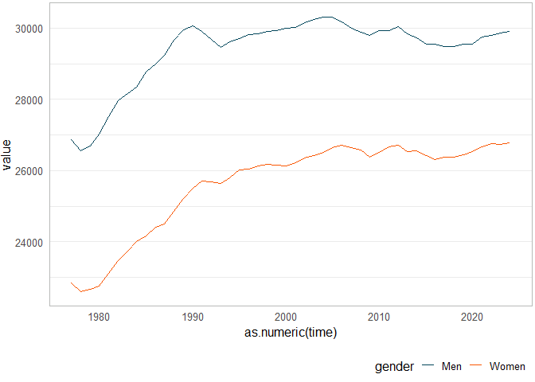

<!-- README.md is generated from README.Rmd. Please edit that file -->

# statgl

Query and visualize data published by Statistics Greenland.

## Installation

You can install the development version of statgl from
[GitHub](https://github.com/) with:

``` r
# install.packages("devtools")
devtools::install_github("StatisticsGreenland/statgl")
```

To load the package contents to the R environment, run:

``` r
library(statgl)
#> R Statistics Greenland (0.2.2.9004)
```

## Search

Use `statgl_search` to do a freetext search of the Greenland Statbank:

``` r
statgl_search("population jan* 1st")
#> # A tibble: 137 × 6
#>    id       title                                    type  path  score published
#>    <chr>    <chr>                                    <chr> <chr> <dbl> <chr>    
#>  1 BEESTA   Population January 1st 1977-2023         t     /BE/… 0.342 2023-02-…
#>  2 BEEST1   Population January 1st 1977-2020         t     /BE/… 0.342 2020-02-…
#>  3 BEESTAYY Population January 1st, fixed residence… t     /BE/… 0.290 2023-02-…
#>  4 BEESTB   Population in Municipalities January 1s… t     /BE/… 0.290 2023-02-…
#>  5 BEESTC   Population in Districts and Municipalit… t     /BE/… 0.290 2023-02-…
#>  6 BEESTD   Population in Localities January 1st 19… t     /BE/… 0.290 2023-02-…
#>  7 BEESTDt  Population seniority in Localities Janu… t     /BE/… 0.290 2023-02-…
#>  8 BEESTNUK Population In Nuuk January 1st by cityd… t     /BE/… 0.290 2023-02-…
#>  9 BEEST2A  Population in  municipalities(2018) Jan… t     /BE/… 0.290 2017-10-…
#> 10 BEEST2   Population in Municipalities January 1s… t     /BE/… 0.290 2020-02-…
#> # ℹ 127 more rows
```

## Fetch

The ID’s found in search results are unique table ID’s, that can be
collected by `statgl_fetch`:

``` r
statgl_fetch("BEESTA")
#> # A tibble: 47 × 2
#>    time  value
#>    <chr> <int>
#>  1 1977  49717
#>  2 1978  49148
#>  3 1979  49338
#>  4 1980  49773
#>  5 1981  50643
#>  6 1982  51435
#>  7 1983  51903
#>  8 1984  52347
#>  9 1985  52940
#> 10 1986  53406
#> # ℹ 37 more rows
```

Eliminable variables are removed by default. To see which variables can
be queried, use `statgl_meta`:

``` r
statgl_meta("BEESTA")
#> Population January 1st by place of birth, gender, age, residence type and time
#> [[1]]
#> # A tibble: 3 × 5
#>   code           text           values valueTexts             elimination
#>   <chr>          <chr>          <chr>  <chr>                  <lgl>      
#> 1 place of birth place of birth T      Total                  TRUE       
#> 2 place of birth place of birth N      Greenland              TRUE       
#> 3 place of birth place of birth S      Born outside Greenland TRUE       
#> 
#> [[2]]
#> # A tibble: 3 × 5
#>   code   text   values valueTexts elimination
#>   <chr>  <chr>  <chr>  <chr>      <lgl>      
#> 1 gender gender T      Total      TRUE       
#> 2 gender gender M      Men        TRUE       
#> 3 gender gender K      Women      TRUE       
#> 
#> [[3]]
#> # A tibble: 100 × 5
#>    code  text  values valueTexts elimination
#>    <chr> <chr> <chr>  <chr>      <lgl>      
#>  1 age   age   0      0          TRUE       
#>  2 age   age   1      1          TRUE       
#>  3 age   age   2      2          TRUE       
#>  4 age   age   3      3          TRUE       
#>  5 age   age   4      4          TRUE       
#>  6 age   age   5      5          TRUE       
#>  7 age   age   6      6          TRUE       
#>  8 age   age   7      7          TRUE       
#>  9 age   age   8      8          TRUE       
#> 10 age   age   9      9          TRUE       
#> # ℹ 90 more rows
#> 
#> [[4]]
#> # A tibble: 8 × 5
#>   code           text           values valueTexts           elimination
#>   <chr>          <chr>          <chr>  <chr>                <lgl>      
#> 1 residence type residence type T      Total                TRUE       
#> 2 residence type residence type A      Capital city         TRUE       
#> 3 residence type residence type B      Main settlements     TRUE       
#> 4 residence type residence type C      Larger settlements   TRUE       
#> 5 residence type residence type D      Settlements          TRUE       
#> 6 residence type residence type E      Smaller settlements  TRUE       
#> 7 residence type residence type F      Smallest settlements TRUE       
#> 8 residence type residence type G      Other localities     TRUE       
#> 
#> [[5]]
#> # A tibble: 47 × 5
#>    code  text  values valueTexts time 
#>    <chr> <chr> <chr>  <chr>      <lgl>
#>  1 time  time  1977   1977       TRUE 
#>  2 time  time  1978   1978       TRUE 
#>  3 time  time  1979   1979       TRUE 
#>  4 time  time  1980   1980       TRUE 
#>  5 time  time  1981   1981       TRUE 
#>  6 time  time  1982   1982       TRUE 
#>  7 time  time  1983   1983       TRUE 
#>  8 time  time  1984   1984       TRUE 
#>  9 time  time  1985   1985       TRUE 
#> 10 time  time  1986   1986       TRUE 
#> # ℹ 37 more rows
```

Codes from `values` columns can be used to query:

``` r
statgl_fetch("BEESTA", gender = c("M", "K"), age = 0:99)
#> # A tibble: 9,400 × 4
#>    gender age   time  value
#>    <chr>  <chr> <chr> <int>
#>  1 Men    0     1977    428
#>  2 Men    0     1978    443
#>  3 Men    0     1979    410
#>  4 Men    0     1980    427
#>  5 Men    0     1981    507
#>  6 Men    0     1982    510
#>  7 Men    0     1983    529
#>  8 Men    0     1984    494
#>  9 Men    0     1985    519
#> 10 Men    0     1986    564
#> # ℹ 9,390 more rows
```

Use `.eliminate_rest = FALSE` to show all values of remaining
eliminables:

``` r
statgl_fetch("BEXSTA", .eliminate_rest = FALSE)
#> # A tibble: 338,400 × 6
#>    `place of birth` gender age   `residence type` time  value
#>    <chr>            <chr>  <chr> <chr>            <chr> <int>
#>  1 Total            Total  0     Total            1977    820
#>  2 Total            Total  0     Total            1978    834
#>  3 Total            Total  0     Total            1979    816
#>  4 Total            Total  0     Total            1980    861
#>  5 Total            Total  0     Total            1981    970
#>  6 Total            Total  0     Total            1982   1016
#>  7 Total            Total  0     Total            1983   1020
#>  8 Total            Total  0     Total            1984    946
#>  9 Total            Total  0     Total            1985    996
#> 10 Total            Total  0     Total            1986   1115
#> # ℹ 338,390 more rows
```

## ggplot

The package comes with extensions for ggplot2, to create data
visualizations following the Statistics Greenland design manual:

``` r
library(ggplot2)

ggplot(statgl_fetch("BEESTA", gender = c("M", "K"))) +
  geom_line(aes(as.numeric(time), value, color = gender)) +
  scale_color_statgl() +
  theme_statgl()
```


